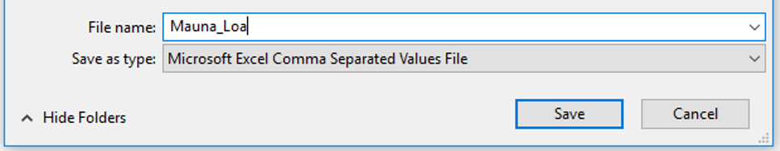
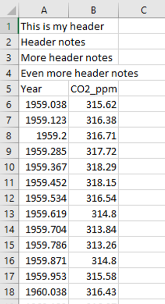
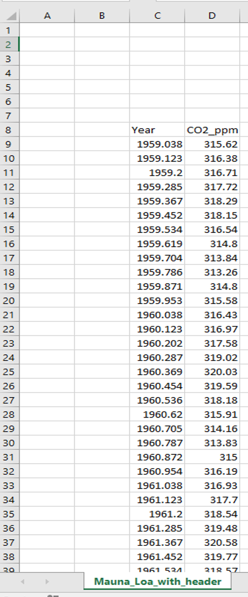

## Loading data into R

We've been loading data into R in nearly every class, but we haven't yet focused on the mechanics of doing this (I've been supplying the data and code to load it in).  Now you'll learn how to load in your own data.  

Most of the data you load in will either be in comma separated values (.csv) or Excel format (.xls or .xlsx).  Excel files and csv files are similar with an Excel file basically a "fancier" version of a csv file that allows you to have "markup" - such as colors, font formatting, cell borders - in addition to your data.  

You can directly load in a csv file or Excel file from your computer (local file) or from a weblink (we've been loading data from my github site in most classes).  


### Load in a `csv` file
Let's start by loading in a .csv file.  

Go to our class website and right-click the link below in today's notebook.  Select "_Save link as..._" and then save this file as "Mauna_Loa" in a sub-folder "Data" within your "Lectures" folder for this class.  Make sure you save it as a csv file 


https://raw.githubusercontent.com/stahlm/stahlm.github.io/master/ENS_215/Data/Mauna_Loa_CO2.csv  

Now navigate to the location where you saved the file and open it in Excel or a basic text editor (e.g. Notepad.  Don't use Microsoft Word). You'll see how the data opens nicely in Excel or a text editor (you'll notice that in the text editor there are commas separating the values).  



<br/> 

Ok, so you've downloaded the data and save it to your computer.  Now you'll want to load it into R so you can start to use the data in your analysis.  

We'll need to use the `read_csv()` function which is in the `readr` package.  Let's load in `tidyverse` which will load in `readr` (along with the many other packages in the tidyverse collection).  

```{r message=FALSE, warning=FALSE}
library(tidyverse)


```

<br/> 

Now to load in the data all we need to do is use the `read_csv()` function and point it to the file we want to load in.  Remember we should always use relative paths.  Since your current working directory is your "Lectures" folder we can start the file path at our "Lectures" folder.  You should first check in your console that your working directory is in fact your "Lectures" folder - you do this by typing `getwd()`.  If your working directory is not your "Lectures" folder then you should make sure to open you "Lectures" project (or ask me for help).  

```{r message=FALSE, warning=FALSE, eval = F}
CO2_data <- read_csv("./Data/Mauna_Loa.csv")
```

<br/> 

Your data should have been loaded into R and saved to the object `CO2_data`.  As you can see R is smart and treats the first row as the column headers (variable names).  Note that the `./` in your file path indicates that you want to begin your path in your current folder.  


So now you know how to load in a csv file!  

However, sometimes things are a bit less neat. For example you may have a file header at the top of your file.  This head might have useful data (e.g. info about the data source) but you would like to skip the head when loading your data into R.  This is easy to do. 

First let's save another csv version of the "Mauna_Loa" data.  You should call this version "Mauna_Loa_with_header".  In this new version add several rows of header info (as seen in the image below) and resave the file (make sure you still save it as a csv).



<br/>

You can see that now we would like to skip the first 4 rows (the ones with file header).  To do this we simply specify how many rows we would like to skip

```{r message=FALSE, warning=FALSE, eval = F}
Mauna_loa <- read_csv("./Data/Mauna_Loa_with_header.csv", skip = 4)
```

Check the `Mauna_loa` data object to confirm that everything looks good.  

<br/>


### Load in an `xls` or `xlsx` file

Loading in an Excel `xls` or `xlsx` file is essentially the same as loading in a `csv` file.  However, we'll first need to load in the `readxl` package which has the necessary functions.

```{r message=FALSE, warning=FALSE}
library(readxl)
```


Let's first save another copy of the Mauna_Loa data, this time saving it as an `xlsx` file that we'll call "Mauna_Loa_excel_example".  You should move your data so that it isn't in the top-left corner of the Excel file (we'll do this to highlight some of the functionality of the `read_xlsx()` function).  



<br/> 

You can see that in the image above, the top-left corner of my data is cell `C8`.  The bottom-right (which you can't see in the image) is in cell `D679`.  The `read_xlsx()` function will always look in the left uppermost cell (i.e. `A1`) first unless you specify otherwise.  Since our data starts elsewhere we'll need to tell the function where to look, however this is very easy to do by simply specifying the `range`.  

```{r message=FALSE, warning=FALSE, eval = F}
Mauna_loa_another_example <- read_xlsx("./Data/Mauna_Loa_excel_example.xlsx", range = "C8:D679")
```

<br/> 

There are lots of additional functionality that can be employed with the `read_xlsx()` function - including loading in data from different sheets (tabs) of the same file.  A quick Google search will show you nice examples demonstrating these additional features.  


