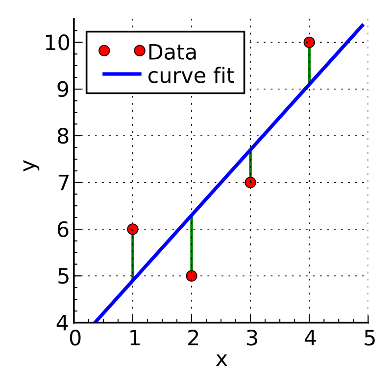

<br/> 

## Data modeling: Basic regression
As scientists and engineers (or anyone else who deals with data) we seek to better understand the processes recorded by our data.  Throughout the term, we have been exploring, summarizing, and visualizing data to help gain insight into the topic of interest and to understand the relationship between variables in our datasets.  

Now we are at the point where we can advance into data modeling.  The ModernDive text (_excerpt below_), does a great job at describing the concept of data modeling:

> The fundamental premise of data modeling is to make explicit the relationship between:  

>  + an outcome variable $y$, also called a dependent variable and
   + an explanatory/predictor variable $x$, also called an independent variable or covariate.  

>Another way to state this is using mathematical terminology: we will model the outcome variable $y$ as a function of the explanatory/predictor variable $x$. Why do we have two different labels, explanatory and predictor, for the variable $x$? That’s because roughly speaking data modeling can be used for two purposes:


1. **Modeling for prediction:**  When we model for prediction we are interested in predicting the outcome of $y$ based on the information contained in the predictor variable(s).  Here we care less about understanding the fundamental relationship between $x$ and $y$ and more about making predictions of $y$ based on information from $x$.  For example, imagine you are a public official responsible for disaster response (e.g., FEMA) and you would like to be able to predict flooding based on the amount of precipitation that has fallen.  Here you don't really care about the fundamental reasons why/how flooding varies with precipitation amount, though you care very much about making accurate predictions of flooding.  

2. **Modeling for explanation:** When modeling for explanation you want to describe and understand the conceptual/fundamental implications of the relationship between the outcome variable $y$ and the explanatory variable $x$.  Let's continue with the issue of flooding, but now we are a hydrologist and we would like to understand the scientific reasons why flooding varies as a function of precipitation amount.  Here you would like to interpret the significance of the relationship between these two variable and we might also want to understand how the relationship varies over time or between different seasons.  Thus, we are modeling in this case with the aim of more deeply understanding the underlying scientific processes.

There are many techniques and approaches to data modeling, though in today's lecture we will focus first on **linear regression** and then move onto non-parametric regression.  


<br/>


### Linear regression
Linear regression is one of the most commonly-used data models and is relatively easy to understand.  We will focus on _simple linear regression_ which is when we have a single numeric explanatory variable $x$ that we will use to explain/predict the outcome of the numeric dependent variable $y$.  

A linear model is of the following form:

$y = \beta_0 + \beta_1*x$


Where $\beta_0$ represents the intercept and $\beta_1$ is the slope. 

A linear regression finds the slope and intercept parameters that generate the best predictions (_i.e._ result in the minimum possible difference between the observed values of $y$ and the predicted values of $\hat{y}$).  


```{r eval = F, echo = F}
# Data prep can be found here
"https://stahlm.github.io/ENS_215/Data/data_prep_intro_to_data_modeling_lecture.Rmd"
```


Let's load in the packages we will need today.  FYI, you'll likely need to install the `moderndive` package.  
```{r message = F}
library(tidyverse)
library(moderndive)
```

<br/> 

>We will use streamflow data from Schoharie Creek (USGS Streamgage 01351500) and precipitation data for the Schoharie Creek watershed area to explore linear regression in today's lecture.  

Let's load in the data 

```{r message = F}
df_flow_precip <- read_csv("https://stahlm.github.io/ENS_215/Data/precip_mv_flow_01351500.csv")
```

```{r}
df_flow_precip <- df_flow_precip %>% 
  select(Year, Month, Precip_inches, flow_inches)
```

```{r}
df_flow_precip <- df_flow_precip %>% 
  mutate(Month_group = str_pad(Month, side = "left", pad = "0", width = 2))
```


Take a look at the data.  You'll see that there is monthly data for precipitation (in inches) and streamflow at Schoharie Creek (in inches) from 1940 onward.  

<br/> 

Right now you are a hydrologist interested in understanding how streamflow (runoff) is generated.  In particular you want to better characterize how precipitation and streamflow are related with the aim of understanding how much flow is generated for a given amount of precipitation.  As a hydrologist you understand that streamflow is ultimately derived from precipitation, however the relationship can be somewhat complex since not all precipitation will reach a river (e.g., some evaporates/transpires) and furthermore there can be delays/lags for precipitation to makes its way to a river (e.g., falls as snow and melts months later, recharges groundwater and takes months or years to reach a stream).  

To start to better get a handle on the above scientific question you would like to conduct a regression to better understand if there is in fact a relationship between precipitation and streamflow.  

Let's first generate a scatter plot to see how the two variables relate to one another.  Recall that we are looking at monthly precipitation and monthly streamflow.  

```{r}
df_flow_precip %>% 
  ggplot(aes(x = Precip_inches, y = flow_inches)) +
  geom_point(alpha = 0.5) +
  
  coord_equal() + 
  theme_classic()
```

So it looks like there might be a relationship between the two variables.  Let's fit a regression line to the data and plot the fitted line on our graphic.  


To plot a regression line we can use the `geom_smooth()` function and specify that we want the fitted line to be a **linear model**.  We specify this by setting `method = "lm"` in the `geom_smooth()` function call. 


```{r}
df_flow_precip %>% 
  ggplot(aes(x = Precip_inches, y = flow_inches)) +
  geom_point(alpha = 0.5) +
  
  geom_smooth(method = "lm") +
  
  coord_equal() +
  theme_classic()
```


You can see that there is a positive relationship between precipitation and streamflow.  Thus, in general, higher the precipitation in a given month translates into higher streamflow in that month.  As hydrologists we are interested in understanding the fundamental relationship between precipitation and streamflow -- in this case the positive relationship (i.e. the positive slope of the linear fit) is consistent with hydrologic theory.  


Note that our linear model is indicated by the blue line.  The gray band around the line is the _standard error_, which is a measure of the uncertianty of the model fit.  You can remove the standard error by specifying `se = FALSE` in the `geom_smooth()` function call.  

Now that we've created a graphic showing the linear regression fit to our data, we would like to actually know the slope and intercept of our model fit.  To get this information we can use the `lm()` function to perform a linear regression.  The `lm()` function does the exact same thing that `geom_smooth(method = "lm")` does, except the `lm()` function allows us to save the model output as opposed to simply plotting the results.  

<br/>

Using `lm()` to perform a linear regression is relatively straightforward -- the sytax is as follows:

  > `lm(data = your_dataframe, formula = y ~ x)`
  
Where, `y` is the dependent variable, `x` is the explanatory/predictive variable and `your_dataframe` is the data frame that contains your `x` and `y` data.  

Let's compute the linear regression to determine the relationship between monthly streamflow and monthly precipitation.  In mathematical terms we are solving for the slope ($\beta_1$) and intercept ($\beta_0$) of the following equation:    

$$Streamflow = \beta_0 + \beta_1 * precipitation$$

<br/>

```{r}
lm_flow <- lm(data = df_flow_precip, formula = flow_inches ~ Precip_inches)

lm_flow
```


<br/>

You can see from out linear regression that the intercept $\beta_0$ = `r round(lm_flow$coefficients[1],2)` and the slope $\beta_1$ = `r round(lm_flow$coefficients[2],2)` 

Thus the equation is:

$Streamflow = `r round(lm_flow$coefficients[1],2)` +`r round(lm_flow$coefficients[2],3)` * precipitation$  

<br/>

This means that for every increase of 1 inch of additional precipitation, the model predicts that there is `r round(lm_flow$coefficients[2],3)` additional inches of streamflow.  As hydrologists this is useful from a _modeling for explanation_ perspective as it can help provide insight into the fundamental understanding of streamflow generation.  The linear model is also useful from a _modeling for prediction_ perspective as it can help us to streamflow (and thus flooding risk) if we have a forecast of upcoming precipitation and it can also help us to predict how streamflow (flooding) will change with any changes in precipitation amount (e.g., due to changing climate).    

<br/>  

We can use the `get_regression_table()` function from the `moderndive` package to get a nicely formatted table with the slope and intercept estimates for our regression as well as some additional information on the uncertainty associated with these estimates.  

```{r}
get_regression_table(lm_flow, digits = 3)
```

<br/> 

> Discussion the following with your neighbors:
- Does the linear model appear to be a good fit to the data? 
- Discuss the meaning of both the slope and intercept of the linear model we fit to the data. 
- Would the model be improved if we were to examine only a subset of the data (e.g., subset of years, or subset of months).  

<br/>

### Regression statistics/goodness-of-fit 
When a linear model is being fit to data, the algorithm (function) that is performing the fit aims to find the "best" model, which in the case of least-squares linear regression means that the algorithm finds the linear model that minimizes the sum of the squared residuals.  

$$ {Sum\:of\:squared\:residuals} = \sum_{i=1}^{n}{(y_i - \hat{y}_i)^2}$$

Where $y_i$ is the i^th^ observation and $\hat{y}_i$ is the i^th^ model fit value.  The differences between the observations and the model predicted values are known as residuals.  

{width=40%}  

<br/> 

In the image above you can see an example figure showing a linear fit (blue line) to data (red points) and the residuals for each point (represented by the green lines).  If a model was a perfect fit then all of the data would fall exactly on the modeled line and the residuals would all be zero.  However, it is essentially never the case that a model is a perfect fit.  

Thus, when we fit a model to data we would like to know is does the model accurately reflect the data.  A model that bares no resemblance to the actual data would not be a good or useful model.  Oftentimes we can visually assess if the model is doing at least an OK job of reflecting the data, however we would really like to apply a more quantitative approach to evaluating the quality of our model than simply a qualitative visual assessment.  

There are many, many different metrics/statistics that have been developed for assessing model fits and this topic could fill many lectures in a statistics course.  For the purposes of today's lecture we will focus on a very commonly used statistic, known as **R-squared**.  While it is beyond the scope of this class to go into great depth on this topic, I will give a brief overview of this statistic and what it means.  

The R-squared statistic tells us how well our explanatory variable (in our example precipitation) explains the dependent variable (in our example streamflow). An r-squared of 1 means the model perfectly explains the variability in the dependent variable and a value of 0 means that the model has no explanatory power (i.e., does not explain any of the variability in the dependent variable).  

<br/> 

Let's take a look at the R-squared for the model we fit above.  We can pass our model `lm_flow` to the `get_regression_summaries()`.  

```{r}
get_regression_summaries(lm_flow)
```


<br/>  

>The fit for our model is not particularly good.  While the slope of the linear model has the correct directionality (i.e., positive), the r-squared is quite low.  

>Given that we might expect streamflow to be linearly related to precipitation, why do you think the relationship is relatively weak between these two variables?  

>Do you think that we may be obscuring relationship by looking at all of the data together?  


<br/>  


### Multiple linear regression 

So far we have explored simple linear regression.  We did so using precipitation and streamflow data for the Schoharie Creek watershed.  This example (1) taught us how to carry out a linear regression, (2) introduced some basic concepts related to linear regressions (e.g., model parameters and model fit), (3) shed light on some of the underlying scientific concepts related streamflow generation.  


Let's now learn some additional aspects of linear regression so that we can extend what we did above with the aim of gaining even more insight into streamflow generation.  

While there is a theoretical/conceptual reason why we might expect a linear model to do a reasonably good job at capturing the relationship between precipitation and streamflow, we saw above that the model does not actually perform well at all.  Upon reflection, we identified that the relationship between precipitation and streamflow may vary between the different months.  Thus we should account for the month when conducting our linear regression.  To account for the month we can either:

**A)** Perform 12 separate linear regressions on streamflow and precipitation (i.e., 12 regressions of the form $Streamflow = b_0 +b_1*precipitation$)

Or 

**B)** Perform a single regression where we account each of the months within that regression.  This approach is called multiple linear regression since it accounts for multiple explanatory variables (i.e., precipitation and month).  


Let's first try at option A.  

<br/>  

#### Option A: Regressing on groups/subsets

We can quickly perform 12 separate linear regression (i.e., one for each month) simply by faceting (by Month) a ggplot figure where we have fit a `geom_smooth(method = "lm")` to a scatter plot of streamflow vs. precipitation.  In this case, faceting is essentially allowing us to account not only for how precipitation affects streamflow, but also how the time of year (Month) affects this relationship.  Thus, we are now accounting for two explanatory variables: preciptation and month.  


```{r}
df_flow_precip %>% 
  ggplot(aes(x = Precip_inches, y = flow_inches)) +
  geom_point(alpha = 0.25) +
  
  geom_smooth(method = "lm", se = F) +
  
  geom_abline(slope = 1, intercept = 0, 
              color = "red", 
              linetype = "dashed") + # one-to-one line to help with interpretation
  
  facet_wrap(~Month_group) +
  
  theme_bw()
```

Note: The red dashed line is a one-to-one line which is there to help with the interpretation of the figure.  The regression line is the solid blue line.     

<br/>  

>Now we can see twelve individual linear regressions (one for each month) of streamflow and precipitation.  

>Do the monthly regressions look better than the regression from earlier where all of the data was combined?  

>Compare and contrast the regressions for each month.  What do you observe?  What can we learn about the underlying environmental processes from these similarities and differences between the months? 


<br/>

The faceting approach is quick and easy, but it doesn't directly output the model coefficients (i.e., slope and intercept) or the model goodness-of-fit data.  If we want this data then we can simply run the linear regression for each of the individual months.  As an example, let's fit a linear model to just the April data.  To do this we `subset` our data with the `lm()` to only include May (i.e., `Month_group = "05"`).  

```{r}
lm_flow_may <-   lm(formula = flow_inches ~ Precip_inches, 
                    data = df_flow_precip, 
                    subset = Month_group == "05")
```

<br/>

Below are the regression coefficients for the linear regression of streamflow and precipitation for just the May data.  
```{r}
get_regression_table(lm_flow_may)
```


<br/>

Below is the regression summary statistics for the linear regression of streamflow and precipitation for just the May data.  
```{r}
get_regression_summaries(lm_flow_may)
```

<br/> 

>Try the above approach for a different month.  How does that month compare to May?  What are the implications of any differences you observe between the May and your selected month.  


<br/> 

#### Option B: Linear regression with multiple explanatory variables

The approach that we saw in our faceted figure which has a linear regression for each month (i.e., 12 regressions in total) can also be achieved using one multiple regression model.  


In this case we are fitting a linear model that predicts (explains) streamflow as a function of precipitation (which is a continuous variable) and month (which is a categorical variable).  

To implement this type of multiple linear regression model we will still use the `lm()` function, however when we define the `formula` we need to specify what is known as an **interaction** term.  In our case the month will act as the interaction term.  Essentially, what the interaction term does is specify an adjust to slope and intercept terms for each of the individual months.  

<br/> 

Let's go ahead and perform this regression.  


```{r}
lm_interactions_months <- lm(data = df_flow_precip, 
                             formula = flow_inches ~ Precip_inches*Month_group)
```

<br/> 

Now let's examine the model coefficients.  

```{r}
get_regression_table(lm_interactions_months) 

```

<br/> 

You can see there is an "intercept" term and a "Precip_inches" term.  These are the intercept and slope of the linear model for the _baseline level_, which is the month of January ("01").  

Thus, $Streamflow_{Jan}= -0.097+0.504*precipitation$  

By default, R used the first month (i.e., Jan) as the _baseline level_.  

<br/>  

To determine what the linear model is for any of the other months, we simply need to add that month's intercept interaction term to the baseline intercept and that month's slope interaction term to the baseline slope.  For example, to get the linear model for May we would take May's intercept interaction term (i.e., "Month_group: 05" in the table above) and May's slope interaction term (i.e., "Precip_inches:Month_group05") and add their to the baseline terms.  

So, May's intercept would be (-0.097 + -0.075	= -0.172) and May's slope would be (0.504 + 0.019 = 0.523).  

Thus, $Streamflow_{May}= -0.172+0.523*precipitation$


<br/>  

We can also take a look at the goodness-of-fit statistics for the multiple linear regression model.
```{r}
get_regression_summaries(lm_interactions_months)
```

>How do the goodness-of-fit statistics for the multiple linear regression compare against those of the simple linear regression that did not account for the month variable (see example at the beginning of the lecture notes)?


<br/> 

Today we just touched upon simple linear regression and multiple regression.  For a bit more depth on these topics take a look at [chapter 5 (Simple Linear Regression)](https://moderndive.com/v2/regression.html) and [chapter 6 (Multiple Regression)](https://moderndive.com/v2/multiple-regression.html) of the ModernDive textbook.  


```{r echo = F, eval= F}
models <- df_precip_flow %>%
  group_by(Month) %>%
  do(model = lm(flow_inches ~ Precip_inches, data = .))

models

get_regression_table(models$model[[4]])
```

